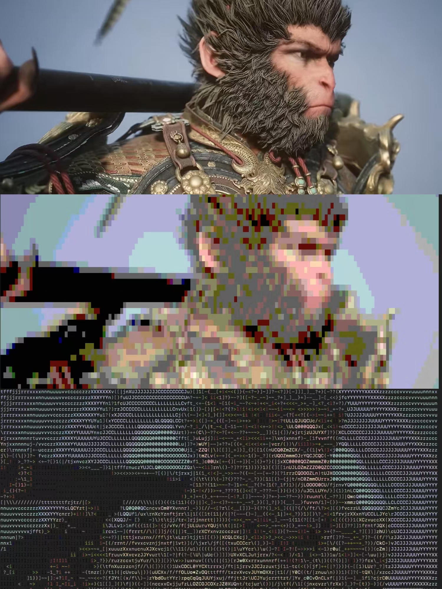

# Convert2Ascii

Convert Image/Video to ASCII art.


## Intro

convert2ascii provides two executable commands：

* image2ascii: transform picture to ascii art and display in terminal.
* video2ascii: transform video to ascii art, you can save or play it in terminal.

It also provides classes as a gem:

* Convert2Ascii::Image2Ascii
* Convert2Ascii::Video2Ascii

you can use it in your code and make your own ascii art !


## Test pass

* MacOS 15.2 ✅
* Ubuntu 24.04 ✅
* Windows 11  ❌


## Example




## Prerequisites

* Ruby 3+
* ImageMagick ([Download here](https://imagemagick.org/script/download.php))
* ffmpeg ([Download here](https://www.ffmpeg.org/))

# How to use

## Try in Docker

`$ docker run -it -v $(pwd):/app  mark24code/convert2ascii bash -c "cd /app && exec bash"`

>  `$(pwd)` can be changed to your local path. Here, use your working path.


## Install

`$ gem install convert2ascii`


## Executable commands

### image2ascii

Convert an image to ascii art.

```bash
image2ascii -h
Usage: image2ascii [options]
        --version                    version
    -i, --image=URI                  image uri (required)
    -w, --width=WIDTH                image width (integer)
    -s, --style=STYLE                ascii style: 'color'/'text'
    -b, --block                      ascii color style use BLOCK or not true/false
```

### video2ascii

Convert a video to ascii art.

```bash
Usage: video2ascii [options]

* By default, it will generate and play without saving.
* The -p option will just play the ascii frames within the directory, and ignore -i, -o other options. --loop will play loop
* -i,-o will just generate and output frames and ignore others options
        --version                    version
    -i, --input=URI                  video uri (required)
    -w, --width=WIDTH                video width (integer)
    -s, --style=STYLE                ascii style: ['color'| 'text']
    -b, --block                      ascii color style use BLOCK or not [ true | false ]
    -o, --ouput=OUTPUT               save ascii frames to the output directory
    -p, --play_dir=PLAY_DIRNAME      input the ascii frames directory to play
        --loop
```


## As a Gem

### Convert2Ascii::Image2Ascii


```ruby
require 'convert2ascii/image2ascii'

# generate image
uri = "path/to/image"
ascii = Convert2Ascii::Image2Ascii.new(uri:, width: 50)

# generate image
ascii.generate
# display in your terminal
ascii.tty_print


# also chain call
ascii.generate.tty_print

```


### Convert2Ascii::Video2Ascii

```ruby
require 'convert2ascii/video2ascii'

# generate video
uri = "path/to/video.mp4"
ascii = Convert2Ascii::Video2Ascii.new(uri:, width: 50)
# generate video
ascii.generate
# save frames
ascii.save(output_path)

# play in terminal
ascii.play


# chain call
ascii.generate.play

```


## Inspired by

* [michaelkofron/image2ascii](https://github.com/michaelkofron/image2ascii)
* [andrewcohen/video_to_ascii](https://github.com/andrewcohen/video_to_ascii)
