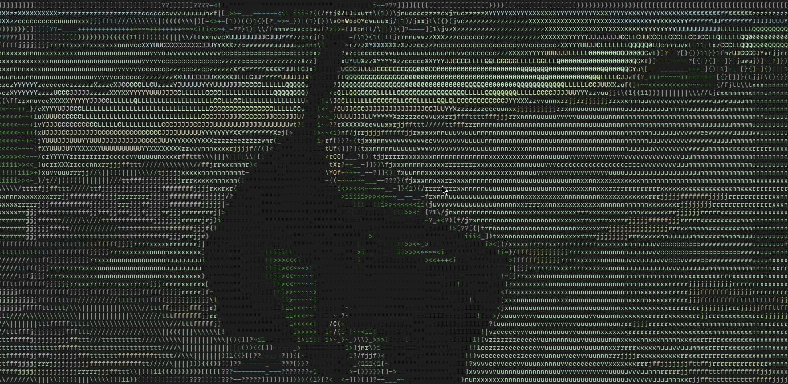

# Convert2Ascii

Convert2Ascii 的 **Go 版**：把图片 / 视频在终端里渲染成 ASCII art，提供两个可执行命令 `image2ascii`（单张图片）与 `video2ascii`（视频，**边转换边在终端实时播放**）。

## Intro

convert2ascii 提供两个可执行命令：

* **image2ascii**：把图片转换成 ASCII art 并显示在终端（支持本地路径与 http(s) 链接）。
* **video2ascii**：把视频转换成 ASCII art，直接在终端实时播放（含同步音频）。

同时它也以 Go 库的形式对外提供 `convert2ascii` 包：

* `convert2ascii.NewImage2Ascii`
* `convert2ascii.NewVideo2Ascii`
* `convert2ascii.PlayFrames`

你可以在自己的代码里复用它，做出你自己的 ASCII art！

## 为什么是 Go？—— 本版本特色

这是原 Ruby gem 的 Go 重写。换成 Go 之后，带来这些新特性：

* **🚀 高性能**：多核并行解码（视频分段并行）+ 工作池并行渲染。本机实测 8.72 s 的视频全流程生成仅需约 0.26 s，**约 34× 实时**（详见 [性能](#性能performance)）。
* **▶️ 实时播放**：默认模式边转码边在终端播放，画面与音频同步，无需等待整段处理完成。
* **🪶 流式内存 O(1)**：播放模式逐帧流式取帧、生成模式逐帧落盘，内存占用与视频时长无关，超长视频也不会卡顿。
* **📦 单一二进制**：编译成原生可执行文件直接运行，不再依赖 Ruby / ImageMagick / gem 运行时。
* **🔗 cgo 直连 FFmpeg**：解复用 / 解码 / 缩放全部走 FFmpeg 原生 API（libavcodec / libavformat / libavutil / libswscale），无需命令行子进程。
* **📊 内置基准**：`go run ./cmd/bench` 一条命令量化各阶段耗时。
* **🧩 同时是 Go 库**：API 对齐原 Ruby 类（`Image2Ascii` / `Video2Ascii`），可在代码中复用。

## 运行环境（Test pass）

* macOS（Apple Silicon，Go 1.27，FFmpeg 8.1）✅ 实测
* Ubuntu / Linux（需 FFmpeg 开发库）—— 未实测
* Windows —— 未实测
* Docker —— 见 [Docker](#docker)

## 示例（Example）

* **黑神话：悟空**（图片转 ASCII）


* **黑客帝国：Neo**（视频转 ASCII，实时播放）



* **实际输出**：`test/assets/ruby.jpg`，text 风格、宽 46：

```text
$$$$$$$$$$$$$$$$$$$$$$$$$$$$$$$$$$$$$$$$$$$$$$
$$$$$$$$$$$$$$$$$$$$$$$$$$$$$$$$$$$$$$$$$$$$$$
$$$$$$$$$$$$$$$$$$$$$$$$$$$$$$$$$$$$$$$$$$$$$$
$$$$$$$$$$$$$$$$$$$$$$$$$$$$$$$$$$$$$$$$$$$$$$
$$$$$$$$$$$$$$$$$$$$$$$$$$$$$$$$$$$$$$$$$$$$$$
$$$$$$$$$$$$$$$$$$$$$@&&$$$$$$$$$$$$$$$$$$$$$$
$$$$$$$$$$@YUYjrvJZqwqmZmmm0YnrvXXc$$$$$$$$$$$
$$$$$$$$!I>;,~~~xru]111111ijffiiiI,I:+$$$$$$$$
$$$$$[?X/lil,}]J?ti~]1111ill->u]+,l!<(r+\$$$$$
$$$J(cCv]]]cczcf\fzJ<]}}>!t)?}(vxxu>>>xnn1m$$$
$$$$$}:lnuczvuuttjjruX-~r}+_+i>/rjxncc^"{@$$$$
$$$$$$${[~_)1)_iiii??}}__<::::">?-]-?|($$$$$$$
$$$$$$$$$$1U~+-1?ii}}}vv__+;:!~_-_zf$$$$$$$$$$
$$$$$$$$$$$$(J\[1i~<<<nx!!;I,?])Xv$$$$$$$$$$$$
$$$$$$$$$$$$$$@zz~~<>\ttt<>_-vz$$$$$$$$$$$$$$$
$$$$$$$$$$$$$$$$$aXX](|/t{nv*$$$$$$$$$$$$$$$$$
$$$$$$$$$$$$$@BB8&WWUctfxYWW&8%B@@$$$$$$$$$$$$
$$$$$$$$$$@@B8W*hdmLXx\\xXLmdh*W8%@$$$$$$$$$$$
$$$$$$$$$$$$$$@@BBB%888%%8%%BB@@$$$$$$$$$$$$$$
$$$$$$$$$$$$$$$$$$$$$$$$$$$$$$$$$$$$$$$$$$$$$$
$$$$$$$$$$$$$$$$$$$$$$$$$$$$$$$$$$$$$$$$$$$$$$
$$$$$$$$$$$$$$$$$$$$$$$$$$$$$$$$$$$$$$$$$$$$$$
$$$$$$$$$$$$$$$$$$$$$$$$$$$$$$$$$$$$$$$$$$$$$$
```

> 默认是彩色风格（ANSI 前景色字符，`-b` 可换成实心色块），这里展示的是 `-s text` 纯字符输出。

## 前置要求（Prerequisites）

* **Go ≥ 1.25** —— 构建用，`go.mod` 声明的最低版本（推荐 1.27+）。
* **FFmpeg 开发库** —— 构建用，cgo 链接 `libavcodec` / `libavformat` / `libavutil` / `libswscale`。
  * macOS：`brew install ffmpeg`
  * Debian / Ubuntu：`apt-get install ffmpeg libavcodec-dev libavformat-dev libavutil-dev libswscale-dev`
* 终端需支持 ANSI 彩色转义（彩色模式需要）。

## 构建（Build）

```bash
make build        # 产出 bin/image2ascii 与 bin/video2ascii
```

也可以直接用 go build：

```bash
go build -o bin/image2ascii ./cmd/image2ascii
go build -o bin/video2ascii ./cmd/video2ascii
```

## 使用（Usage）

### image2ascii —— 图片转 ASCII

```bash
bin/image2ascii -i <image> [-w WIDTH] [-s color|text] [-b]
```

```bash
# 直接输出到终端（默认彩色，宽度为终端列数）
bin/image2ascii -i test/assets/ruby.jpg

# 指定宽度、纯字符风格
bin/image2ascii -i test/assets/ruby.jpg -w 80 -s text

# 也支持 http(s) 链接
bin/image2ascii -i https://example.com/logo.png -w 100
```

### video2ascii —— 视频转 ASCII

边转码边在终端实时播放（含同步音频）：

```bash
bin/video2ascii -i <video> [-w WIDTH] [-s color|text] [-b] [--loop]
```

```bash
# 例子：实时播放，宽度缺省为终端列数
bin/video2ascii -i videos/demo.mp4

# 指定宽度、纯字符风格；--loop 循环播放
bin/video2ascii -i videos/demo.mp4 -w 80 -s text --loop
```

> Go 版渲染走流式管道，不需要保存帧 / meta.json 辅助，因此 `-o`（保存帧）、`-p`（重放帧目录）已从命令行移除；如需在代码里保存帧目录或重放，见下文「作为 Go 库使用」。

### 选项一览

| 选项 | 说明 |
|---|---|
| `-i, --image / --input` | 图片 / 视频路径（必填） |
| `-w, --width` | 输出宽度（字符数）；缺省为终端列数 |
| `-s, --style` | `color`（彩色，默认）或 `text`（纯字符） |
| `-b, --block` | 彩色模式下使用实心色块 |
| `--loop` | video：循环播放 |
| `--version` | 打印版本信息 |

## 性能（Performance）

内置基准测试，按阶段打印耗时并对比全流程（处理期间音频与视频解码并行，各阶段之和大于全流程，体现流水线重叠）：

```bash
go run ./cmd/bench <video> [width] [style]
```

本机实测（Apple Silicon 8 核，Go 1.27，FFmpeg 8.1）：

> 测试视频 `test/assets/fireworks.mp4`（1280×720，8.72 s，含音频），宽度 80（输出 80×22），25 fps

| 阶段 | 耗时 | 吞吐 |
|---|---|---|
| 音频提取 | 0.020 s | — |
| 视频帧提取 | 0.212 s | 984 帧/s |
| ASCII 转换 | 0.018 s | 11840 帧/s |
| **全流程（Generate 总耗时）** | **0.258 s** | ≈ **34× 实时** |

* 8.72 s 的视频全流程生成只要 0.26 s，远快于播放速度，因此默认模式能边处理边实时播放。
* 生成 + 保存模式直接写目标目录、播放模式逐帧从磁盘读取，内存占用与视频时长无关——超长视频也不会因内存增长而卡顿。
* 性能受机器、视频分辨率与宽度影响：宽度越大、分辨率越高耗时越长。可按需自测上面的 bench 命令。

## Docker

构建 Go 版镜像（内置 FFmpeg 与编译好的二进制）：

```bash
docker build -t convert2ascii .
```

挂载当前目录、在容器内运行：

```bash
# 图片转 ASCII（容器内 image2ascii 已加入 PATH）
docker run --rm -it -v "$PWD":/host -w /host convert2ascii image2ascii -i test/assets/ruby.jpg -w 46

# 视频实时播放（-it 提供终端；容器内通常无音频设备，音频会自动降级为无声）
docker run --rm -it -v "$PWD":/host -w /host convert2ascii video2ascii -i videos/demo.mp4
```

> `-v "$PWD":/host -w /host` 把宿主机当前目录挂载进容器并作为工作目录，图片 / 视频直接读写即可。

## 作为 Go 库使用（As a Library）

### 图片 → ASCII

```go
package main

import (
	"fmt"

	"github.com/Mark24Code/convert2ascii/go2ascii" // 包名为 convert2ascii
)

func main() {
	img := convert2ascii.NewImage2Ascii(convert2ascii.ImageOptions{
		URI:   "path/to/image.jpg",
		Width: 80, // 0 = 终端列数
	})
	if err := img.Generate(); err != nil {
		panic(err)
	}
	fmt.Print(img.String())
}
```

### 视频 → 实时播放（及库能力：保存 / 重放）

```go
// 实时播放（与 CLI 一致）：Generate 后直接 Play，含同步音频
v := convert2ascii.NewVideo2Ascii(convert2ascii.VideoOptions{URI: "path/to/video.mp4", Width: 80})
if err := v.Generate(); err != nil {
	panic(err)
}
if err := v.Play(false); err != nil { // true = 循环播放
	panic(err)
}

// 库能力：保存帧目录（N.txt + audio.wav + meta.json）—— CLI 已移除 -o/-p，库内仍可用
v2 := convert2ascii.NewVideo2Ascii(convert2ascii.VideoOptions{
	URI:    "path/to/video.mp4",
	Width:  80,
	Output: "/tmp/ascii_frames", // 设置后：生成并保存，不播放
})
if err := v2.Generate(); err != nil {
	panic(err)
}

// 库能力：重放已保存的帧目录
if err := convert2ascii.PlayFrames("/tmp/ascii_frames", false); err != nil {
	panic(err)
}
```

## 测试（Test）

```bash
make test            # go test ./...；需 FFmpeg 开发库
go test -race ./...  # 含并行解码的竞态检测
```

## Version

```bash
bin/image2ascii --version
bin/video2ascii --version
```

* 版本：v0.1.0
* 项目：<https://github.com/Mark24Code/convert2ascii>

## Inspired by

* [michaelkofron/image2ascii](https://github.com/michaelkofron/image2ascii)
* [andrewcohen/video_to_ascii](https://github.com/andrewcohen/video_to_ascii)
